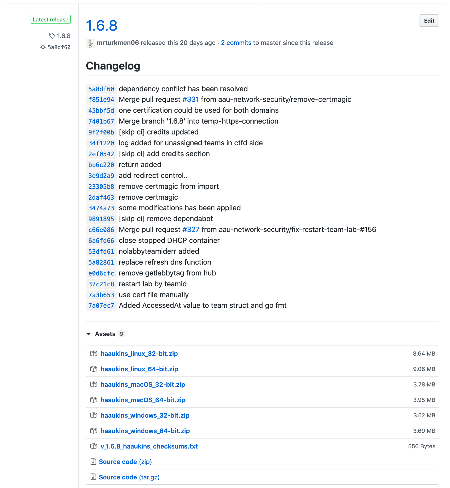
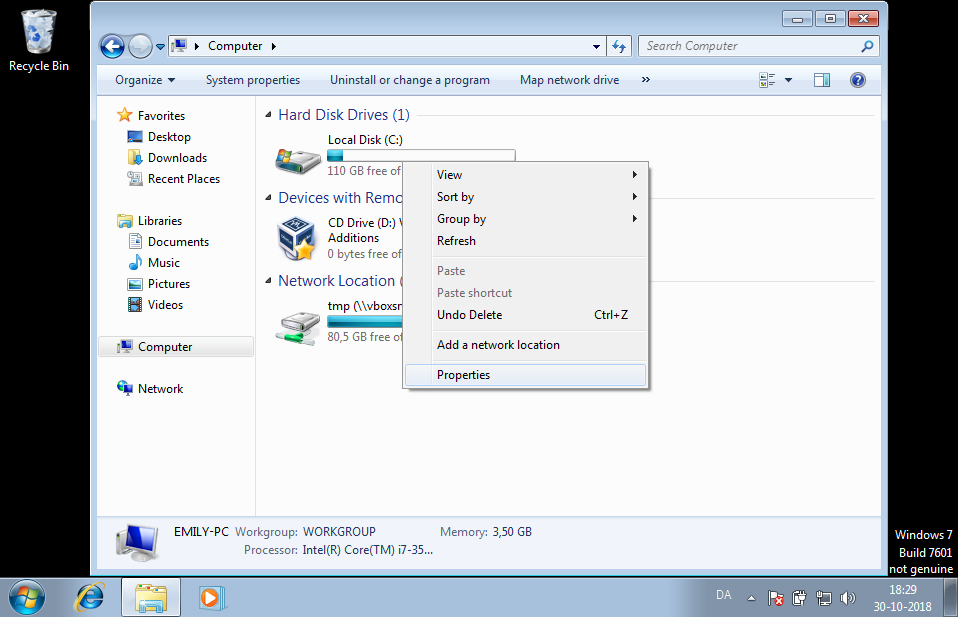
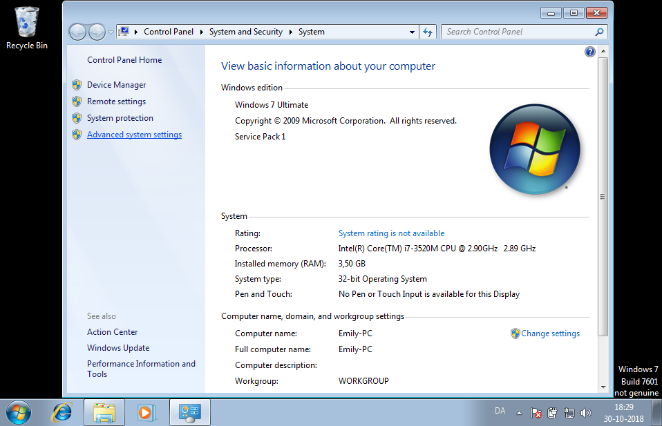
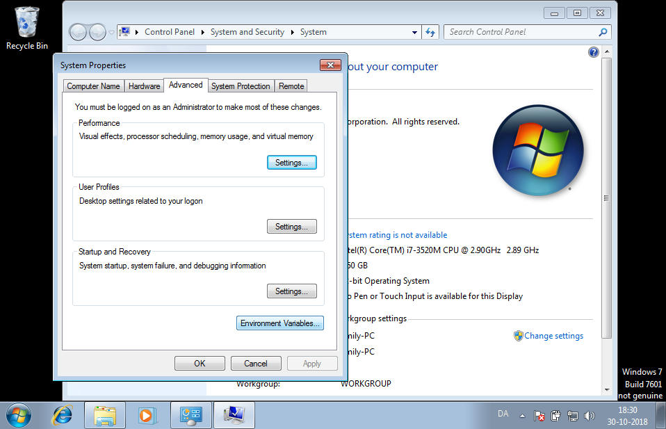
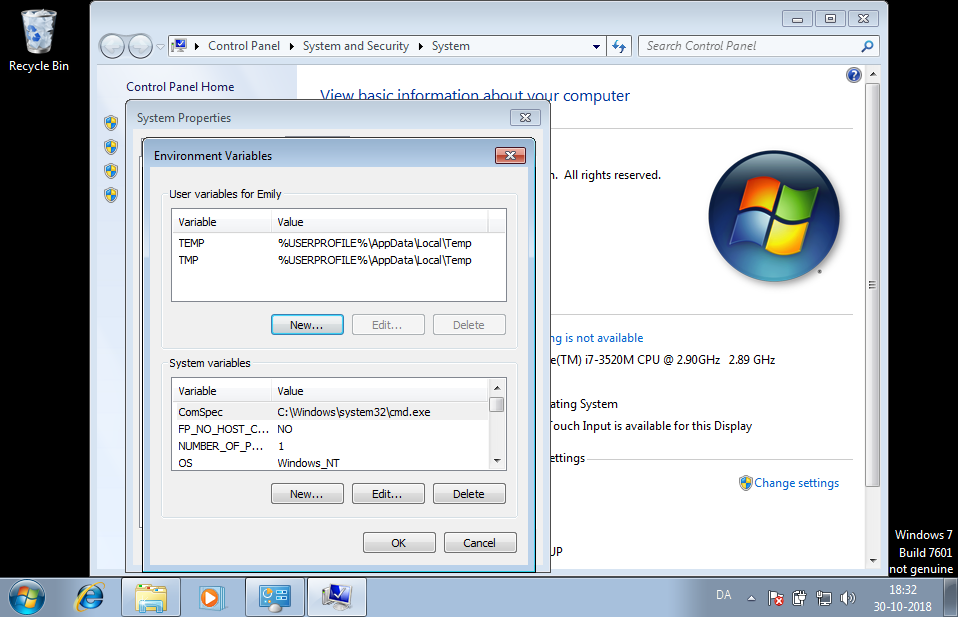
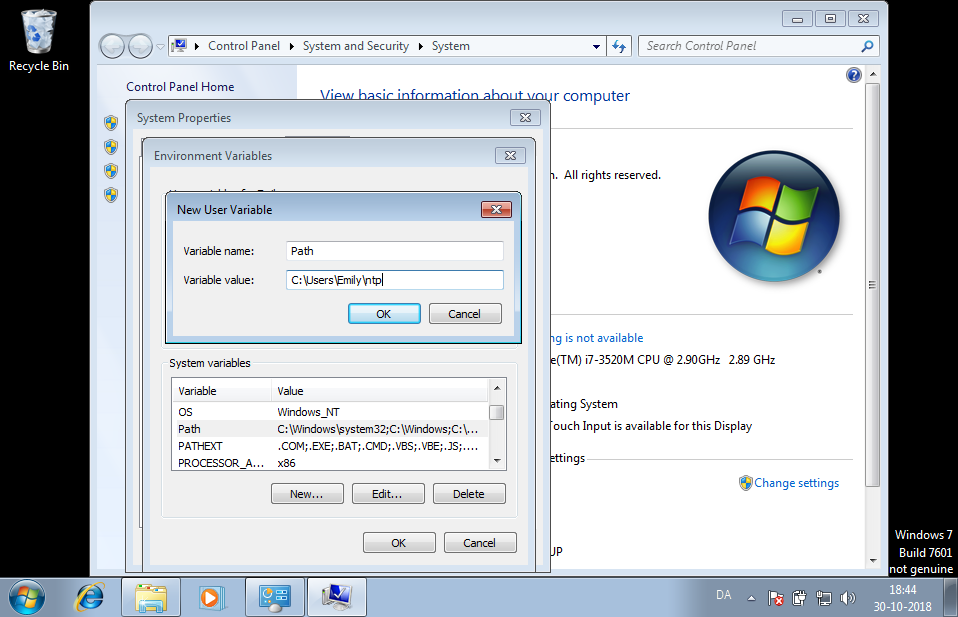
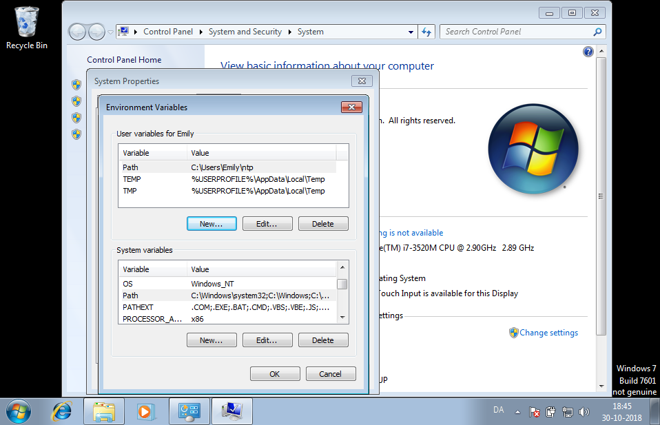
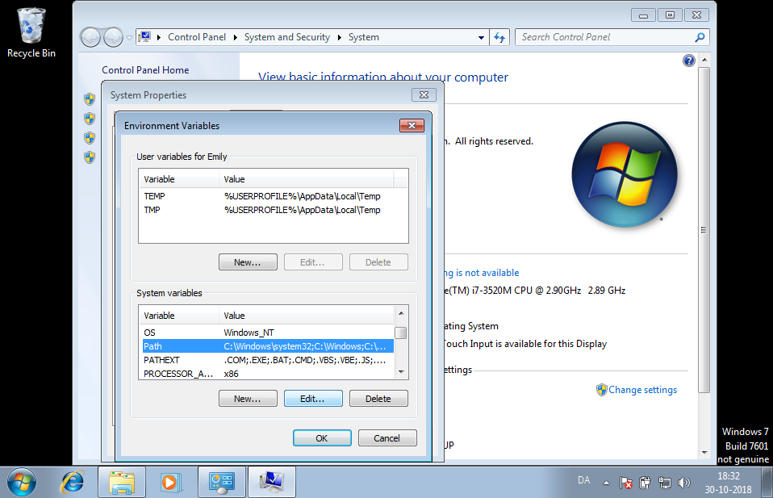

- [Server Installation](#server-installation)
  - [Configuration files and directory structure](#configuration-files-and-directory-structure)
  - [Systemd Configuration](#systemd-configuration)
- [Client Installation](#client-installation)
  - [Linux and OSX](#linux-and-osx)
    - [Globally](#globally)
    - [Locally](#locally)
    - [Troubleshooting](#troubleshooting)
  - [Windows](#windows)
    - [Globally](#globally-1)
    - [Locally](#locally-1)
    - [Rest of the installation (environment variables)](#rest-of-the-installation-environment-variables)
  - [CLI Format Guideline](#cli-format-guideline)
    - [Format](#format)
    - [Entities](#entities)
    - [Actions](#actions)
    - [Arguments](#arguments)
    - [Identifiers](#identifiers)
      - [Examples](#examples)


# Server Installation 

This page describes the process of configuring a host for running the Haaukins daemon, `hknd`.
The daemon has only been tested on a Linux host with `systemd`, but binaries for other operating systems can be build as well.

For the remainder of the Wiki, we assume a user `hknd` user exists with home directory `/home/hknd`.

## Configuration files and directory structure

The following is the default directory structure:
```
.
|-- config.yml
|-- events
|   |-- test-10-04-19
|   |   |-- 005850db.log
|   |-- test-10-04-19.yml
|-- exercises.yml
|-- frontends.yml
|-- hknd
`-- users.yml
```
The `hknd` file is the binary, and by default is uses `config.yml` in the working directory as its primary configuration file.
The following `YAML` files must be created manually and serve as configuration files for `hknd`:

| Configuration file | Purpose                                                   |
|--------------------|-----------------------------------------------------------|
| `config.yml`       | The main configuration file                               |
| `exercises.yml`    | The specification of the exercises                        |
| `frontends.yml`    | The specification of the existing frontends               |

The `users.yml` acts as a database that stores the information of CLI users.

The `event` directory serves as a database for events, such as the registered teams, the progress of teams and the monitored mouse clicks and key strokes.

- **config.yml**

Example
```yaml
host:
  http: ntp-event.dk
  grpc: cli.sec-aau.dk
port:
  insecure: 8080
  secure: 8081
sign-key: ...
tls:
  enabled: true
  acme:
    email: ...
    api-key: ...
    development: false
docker-repositories:
- username: ...
  password: ...
  serveraddress: ...
ova-directory: "/scratch/ova"
exercises-file: "...."
users-file: "<location-of-users-file>"
exercises-file: "<location-of-exercises-file>"
frontends-file: "<location-of-frontends-file>"
```
The daemon can listen on two different host names for the reverse proxy and the gRPC traffic.
In case a HTTPS connection is preferred, the TLS configuration must be enabled, and both the secure (HTTP) and insecure (HTTPS) port must be configured.

If TLS is enabled, the `acme` field must be filled in, which ensures that `hknd` manages the TLS certificates.

**- Note -** as of now, only Cloudflare is supported as the ACME DNS provider.

The `docker-repositories` and `ova-directory` specify from which Docker repository and path on the filesystem `hknd` retrieves the images for the virtual instances.

For all (latest) configuration options, take a look at the `Config struct` in [Golang source code](https://github.com/aau-network-security/haaukins/blob/master/daemon/daemon.go#L82).

- **exercises.yml**

Example

```yaml
exercises:
  - name: Cross-site Request Forgery
    tags:
    - csrf
    docker:
    - image: <image name>
      dns:
      - name: formalbank.com
        type: A
      memoryMB: 80
      flag:
      - tag: csrf-1
        name: Cross-site Request Forgery
        env: APP_FLAG
        points: 12
```
This file contains a list of all exercises that can be run on Haaukins.

For all (latest) configuration options, take a look at the `Exercise struct` in the [Golang source code](https://github.com/aau-network-security/haaukins/blob/master/store/exercise.go#L41).

- **frontends.yml**

Example

```yaml
frontends:
- image: kali
  memoryMB: 4096
  cpu: 2
```

Contains a list of all frontends that Haaukins.
The value of `image` can be used as a tag when creating a new event from the CLI.
The daemon searches for the path `<ova-directory>/<image name>.ova`, where `ova-directory` is retrieved from the `config.yml`, and the `image name` is provided by the CLI user.


## Systemd Configuration 

Create a user named `hknd` and and add the following system service configuration to `/lib/systemd/system/hknd.service`:
```ini
[Unit]
Description=Haaukins (Daemon)
ConditionPathExists=/home/hknd/daemon
After=network.target

[Service]
Type=simple
User=hknd
Group=hknd
LimitNOFILE=1024

Restart=on-failure
RestartSec=10
StartLimitIntervalSec=60
TimeOutStopSec=300

WorkingDirectory=/home/hknd/daemon
ExecStart=/home/hknd/daemon/hknd

# removing leftover docker-containers and virtualmachines
ExecStopPost=/bin/bash /home/hknd/daemon/clean-up.sh

# make sure log directory exists and owned by syslog
PermissionsStartOnly=true
ExecStartPre=/bin/mkdir -p /var/log/hknd
ExecStartPre=/bin/chown root:adm /var/log/hknd
ExecStartPre=/bin/chmod 755 /var/log/hknd
StandardOutput=syslog
StandardError=syslog
SyslogIdentifier=hknd

[Install]
WantedBy=multi-user.target
```

In some cases, some vms and docker containers might leftover, which means that even though Haaukins service has been stopped by running following command: 

    `systemctl stop hknd` 

there could be some number of vms and docker containers which are running (although they should not). For such a situation, `ExecStopPost` script should be included into service file as well. The script for cleaning up leftovers from Haaukins (- after Haaukins service is stopped-) is given below; 

- **clean-up.sh**

```bash 
#!
# Killing containers which has label of "hkn"
docker kill $(docker ps -q --filter "label=hkn")
# Removing killed containers which have label of "hkn"
docker rm $(docker ps -q -a --filter "label=hkn" --filter status=exited)
# Prune Network bridges which are not used by any container
docker system prune -f  
docker network prune -f

docker volume prune -f
# Close running vms all
VBoxManage list runningvms | awk '{print $2;}' | xargs -I vmid VBoxManage controlvm vmid poweroff
## Unregister VMs ID
VBoxManage list vms | awk '{print $2;}' | xargs -I vmid VBoxManage unregistervm --delete vmid

rm -rf /home/hknd/VirtualBox\ VMs/*
# Cleanup previously imported VMDKs path

```

Note that some paths could differ according to your system. 


#  Client Installation 

Haaukins is designed in a client-server architecture, and thereby requires no access to the actual hardware that it is running on. This also means that the client requires network access (typically through the internet) to the server on which the actual event is being run.

This guide will describe how to install the **client** on **your local machine**, in order for you to interact with the server and thereby manage events.

1. Download the latest version of the client
Navigate to [the releases page](https://github.com/aau-network-security/haaukins/releases) and find the latest version of Haaukins.



You are presented with a lot of zip files which includes all necessary binary , readme and licence files, and you have to select the appropriate binary for your operating system.

You find that by answering two questions:

**What architecture does my operating system run?**

- 32-bit: `ARCH = 386`
- 64-bit: `ARCH = amd64`

**What is the name of my operating system?**

- Mac OSX: `OS = darwin`
- Windows: `OS = windows`
- Linux: `OS = linux`

Then locate the file under the release with the name: `haaukins-[OS]-[ARCH].zip` (e.g. `haaukins_macOS_64-bit.zip` is the client files for Mac OSX running 64-bit)

2. Install client on your system

The binary you downloaded is a statically linked binary, meaning every that it needs in order to make it run is contained inside of it. Now you have to read the individual guide for your personal operating system). The use of `$` denotes that the command is expected to be run in a shell (on Windows this is typically `Start -> Run -> cmd` or PowerShell).

## Linux and OSX

You now have to pick and choose whether you want to install the client globally on your system (the binary will be available to every user) or locally.

### Globally


Navigate (in a terminal) to the folder in which you downloaded the client and perform following steps: 

   - `$ unzip haaukins_macOS_64-bit.zip `

   - `$ mv haaukins_macOS_64-bit/hkn /usr/local/bin/hkn `

   - `$ chmod +x /usr/local/bin/hkn`


Now you should have the `hkn` command available, test it out by running `$ hkn`.

If that is not the case, check your environment variable `$PATH` and make sure use see `/usr/local/bin` in there, else make sure to add it in your `.bashrc` or `.bash_profile` or `.zshrc` (depending on your the shell you use).

### Locally

Navigate to the folder in which you downloaded the client and perform: `$ mkdir -p ~/.local/bin && mv haaukins_macOS_64-bit/hkn ~/.local/bin/hkn`.
After make sure you set the executable bit: `$ chmod +x ~/.local/bin/hkn`
Now you should have the `hkn` command available, test it out by running `$ hkn`. If that is not the case, check your environment variable `$PATH` and make sure use see `$HOME/bin` or `~/bin` in there, else make sure to add it in your `.bashrc` or `.bash_profile` or `.zshrc` (depending on your the shell you use).
This can be done (but might not be needed) by: `$ echo 'PATH="$PATH:$HOME/.local/bin' >> ~/.profile`

### Troubleshooting

If you are unable to move the binary, it is typically because you need super user rights, simple prepend the command with `sudo` and try again.

If you are confused about the command-line in general, please [see this guide](https://linuxjourney.com/lesson/the-shell).

## Windows

### Globally
First navigate `C:\Program Files\` and create a new folder called `hkn`, then place the downloaded file in the newly created folder and rename it to `hkn.exe`.
You should now have the following folder structure `C:\Program Files\hkn\hkn.exe`.

### Locally
Navigate to your home folder, e.g. `C:\Users\Emily`, create a folder called `hkn`, then place the downloaded file in the newly created folder and rename it to `hkn.exe`.
You should now have the following folder structure `C:\Users\Emily\hkn\hkn.exe`.

### Rest of the installation (environment variables)

When this is done, the next thing is to add it to your `PATH`.
Unlike Linux/OSX, on Windows this is done best using the graphical interface.
To do this, first your need to open your `File Explorer`, and make sure you are under where all you disks are listed.




Now click on `Advanced system settings`.



Now click on `Environment Variables`.



Now you can should be presented with this screen.



Now you can either chose to create a new `User variable` for your user, which should be done if you did the local install above, or you can chose to create a new `System variable` which should be done if you did the global install.

For the `User variable`, click `New` in the first box, then fill it with your information.





For the `System variable`, click `New` in the second box, then fill it as follows.




Now you can just open your `cmd` or `powershell`, type `hkn` and you should be all good to go!


## CLI Format Guideline


This page shows the design principles for the cli command format and should therefore be read when implementing new features for the cli client.


### Format

The following structure is used for *ALL* commands.

```bash 
hkn <entity> <action> <args>
```
where `hkn` is the binary, `entity` refers to the entity type, `action` the action to and `args` the required and optional arguments for the `entity` and `action` pair. 
Note that the available actions are dependent on the selected entity, and the available arguments are dependent on the selected entity and action.

### Entities
Examples of entities are as follows:

```bash 
hkn user ...
hkn exercise ...
hkn event ...
```

### Actions
Examples of actions are as follows:

```bash 
hkn user create ...
hkn exercise reset ...
hkn event list ...
hkn group list ...
```

### Arguments
The required and optional arguments vary per entity and action pair.
However, use the following principles:

1. When an identifier refers to the entity in the command, it must be a required argument.
For illustration, the `sql` identifier refers to the `exercise` entity:

```bash 
hkn exercise update sql
```
2. When an identifier does not refer to the entity in the command, it need to be specified as a flag.
In the following example, the `sql` exercise must be reset for group `group1` from event `event1`.
Note that this principle holds for both required and optional arguments.

```bash
hkn exercise reset sql -e event1 -g group1
``` 

### Identifiers
We use the following identifiers

| Entity | Identifier |
|---|---|
| `event` | Each event has a subdomain that is used to route traffic by `Haaukins`. This subdomain is used as an event's identifier.  |
| `exercise` | In the exercise definition file, each exercise has a tag list, and these tags can be used to identify exercises in the cli. |
| `group` | A unique identifier will be generated for groups. In order to get a group's identifier, use a `list` command (see example below). |

#### Examples

List all groups in the event `ev1`:

```bash 
$ hkn group list -ev ev1
GROUP ID         NAME              EMAIL
f58a13m          BestTeam          kh@es.aau.dk
jg018do          WorstTeam         tkp@es.aau.dk
```

Create a new event called `event1` with tag `ev1`

```bash 
$ hkn event create event1 -t ev1
```

Reset the SQL injection exercise for group `BestTeam` in event `ev1`.

```bash 
$ hkn exercise reset sql -e ev1 -g f58a13m
Resetting exercises..
Done!
```
